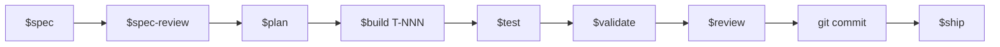

# Développement piloté par les spécifications avec Spring Boot 4, React et Next.js

Une boîte à outils Codex pour piloter le développement full-stack avec
**Spring Framework 7 / Spring Boot 4** et **React avec l’App Router de Next.js**
au moyen d’un workflow documenté et auto-validé :

> **spécifier → relire → planifier → implémenter (TDD) → tester → valider → relire → committer**

L’agent valide son propre travail avec un harness à plusieurs couches
(compilation, analyse statique, architecture, tests, couverture, mutation,
contrat et sécurité), au lieu de demander à un humain d’inspecter chaque ligne.



## Pourquoi

- **Aucune invention.** Pendant la spécification, la revue et la planification,
  chaque incertitude devient une question ouverte suivie, à laquelle vous devez
  répondre avant de poursuivre.
- **TDD par construction.** Le code de production ne peut être écrit qu’après
  l’existence d’un test en échec. Les hooks font respecter cette règle.
- **Traçabilité.** Chaque critère d’acceptation (`AC-NNN`) est relié aux tests,
  au code et aux portes du harness qui l’ont vérifié.
- **Auto-validation.** Un unique `.github/scripts/harness.sh` s’exécute en
  local et en CI ; l’agent lit ses rapports et produit un rapport de validation
  structuré.
- **Revue avant commit.** Un agent applique une grille de revue propre à Spring
  ou à React/Next.js.
- **Natif Codex.** Les instructions, skills, agents et hooks suivent les
  conventions de projet Codex sans copies propres à d’autres plateformes.

## Installation

Cette boîte à outils est un **ensemble de fichiers à déposer dans votre dépôt**,
pas un paquet à installer avec `npm install` ou `mvn install`. Choisissez le
parcours adapté à votre situation.

### Prérequis

- **Backend :** Java 25 et Maven 3.9+ pour exécuter le harness Spring.
- **Frontend :** Node.js 22+ et le gestionnaire de paquets choisi par le projet
  Next.js, pour le lint, le typage, les tests, la compilation et l’e2e.
- [Codex](https://developers.openai.com/codex/) installé et authentifié.
- `bash`, `git` et `jq` disponibles dans le `PATH`.

Un projet uniquement backend n’a pas besoin des outils Next.js, et inversement.

### Option A — Démarrer un nouveau projet depuis cette boîte à outils

```bash
# 1. Cloner le dépôt ou l’utiliser comme modèle
git clone https://github.com/staaack-io/specs-driven-development.git mon-service
cd mon-service
rm -rf .git && git init

# 2. Ajouter le code de l’application Spring Boot 4 sous src/
#    Fusionner .codex/maven/parent-pom-fragment.xml dans pom.xml
#    (ce fragment configure les dix couches : Surefire, Failsafe, JaCoCo, PIT,
#    Checkstyle, SpotBugs, ArchUnit, OWASP Dependency Check et OpenAPI).

# 3. Rendre les scripts et hooks exécutables
chmod +x .github/scripts/*.sh .codex/hooks/*.sh

# 4. Vérifier le branchement du harness
./.github/scripts/harness.sh --report     # exécute le harness et produit un résumé JSON
```

### Option B — Ajouter la boîte à outils à un dépôt Spring existant

```bash
# Depuis la racine du dépôt existant
git clone --depth=1 https://github.com/staaack-io/specs-driven-development.git /tmp/sdd

# Copier le workflow Codex et sa documentation
cp /tmp/sdd/AGENTS.md .
cp -r /tmp/sdd/.agents /tmp/sdd/.codex /tmp/sdd/docs /tmp/sdd/examples .
mkdir -p .github
cp -r /tmp/sdd/.github/scripts .github/

chmod +x .github/scripts/*.sh .codex/hooks/*.sh

# Fusionner ensuite .codex/maven/parent-pom-fragment.xml dans pom.xml.
# Puis lancer le skill d’intégration brownfield depuis Codex.
```

> **À propos de `.github/`** — seul `.github/scripts/` appartient au harness
> d’exécution du framework. Fusionnez ce dossier avec votre configuration GitHub
> existante. Le framework n’installe ni workflow GitHub Actions ni configuration
> Copilot.

### Vérifier l’intégration Codex

1. Ouvrir le dépôt comme projet Codex approuvé.
2. Exécuter `/skills` et confirmer que les skills du dépôt sont listés
   séparément.
3. Exécuter `/hooks`, examiner les commandes des hooks du projet et les
   approuver.
4. Invoquer `$help` pour afficher le workflow du framework.

## Utilisation

Une fois l’installation terminée, piloter le workflow depuis Codex avec les
skills du dépôt. Une invocation explicite utilise `$nom-du-skill` ; Codex peut
également sélectionner un skill à partir d’une demande claire en langage
naturel.

### Phase zéro, uniquement pour un projet brownfield

```text
$onboard
$wire-harness
```

Ces commandes classent le dépôt, capturent une exécution de référence du
harness, écrivent `.specs/_onboarding.md` et `.specs/_known-debt.md`, puis
ajoutent les couches manquantes sous forme de cliquets : les échecs existants ne
bloquent pas le démarrage, mais aucune nouvelle régression n’est acceptée. Voir
[examples/brownfield/README.md](examples/brownfield/README.md).

### Boucle d’une fonctionnalité

```text
$spec "Ajouter le paiement par carte cadeau" # ou : $spec JIRA-123
$spec-review                                  # porte de sortie de la phase 1
$epic-plan                                    # Epic : conception globale et roadmap
$plan                                         # conception, tâches et .tdd-state.json
$build T-001                                  # rouge → vert → refactorisation → simplification
$test --gap                                   # combler les écarts de couverture ou de mutation
$validate                                     # harness complet et traçabilité
$review                                       # revue du code avant commit
git commit                                    # exécuté par VOUS, jamais par l’agent
$ship                                         # plan post-commit, sans déploiement
```

Répéter `$build T-NNN` pour chaque tâche de `04-tasks.md`. L’agent refuse de
modifier `src/main/**` tant que
`.specs/<feature-id>/.tdd-state.json` ne contient pas un test en échec pour la
tâche active.

Pour une Epic, exécuter `$epic-plan` après `$spec-review`, puis `$plan`
afin de produire la conception détaillée et les tâches de chaque tranche depuis
la roadmap approuvée.

### Outils en lecture seule

- `$status` — afficher la position de chaque fonctionnalité dans le cycle.
- `$help [workflow]` — afficher le catalogue ou le détail d’un workflow.

### Formulations en langage naturel

Il n’est pas nécessaire de mémoriser tous les noms. Les descriptions permettent
à Codex de router une demande française claire vers le bon workflow :

| Vous écrivez | Skill exécuté |
| --- | --- |
| « spécifie ceci » / « transforme ce ticket en exigences » | `$spec` |
| « relis la spécification » | `$spec-review` |
| « planifie cette Epic » / « découpe cette Epic » | `$epic-plan` |
| « planifie ceci » / « conçois ceci » | `$plan` |
| « implémente T-003 » / « construis T-003 » | `$build T-003` |
| « valide » / « lance le harness » | `$validate` |
| « relis le code » / « fais la revue avant commit » | `$review` |
| « simplifie le code » | `$code-simplify` |
| « prépare la livraison » | `$ship` |
| « intègre ce dépôt existant » | `$onboard` |

Liste complète : [.agents/skills/](.agents/skills/).

### Exécuter directement le harness

Les mêmes portes de contrôle sont accessibles depuis un terminal :

```bash
./.github/scripts/harness.sh                 # les dix couches
./.github/scripts/harness.sh --report        # produit harness-summary.json
./.github/scripts/check-new-code-coverage.sh # couverture du diff par rapport à main
./.github/scripts/traceability.sh <feature-id>
```

### Hooks et harness : quelle différence ?

Les **hooks** sont de petits garde-fous réactifs. Codex les déclenche
automatiquement avant ou après une action ciblée : écrire un fichier, exécuter
une commande ou terminer une transition TDD. Ils peuvent refuser immédiatement
une action interdite, par exemple modifier du code de production sans test rouge.

Le **harness** est une campagne de vérification globale et reproductible. Il
compile le projet, exécute les tests et analyse la qualité, la couverture, les
mutations, les contrats et la sécurité. Il est lancé explicitement par
`$validate`, depuis un terminal ou par la CI.

En résumé : **un hook protège l’action en cours ; le harness prouve l’état global
du projet**.

## Organisation du dépôt

```text
AGENTS.md         instructions persistantes du projet Codex
.agents/skills/   un dossier par skill métier ou de workflow
.codex/           agents · hooks · modèles · checklists · configuration Maven
.github/scripts/  scripts déterministes du harness, sans configuration Copilot
docs/             méthode · harness · format des specs · migration · contrats
examples/         exemples greenfield et brownfield
```

Chaque skill possède une seule source de vérité. Les skills de workflow
référencent les skills métier par leur nom et ne fusionnent jamais leurs
instructions.

## Artefacts du workflow

Chaque fonctionnalité vit sous `.specs/<feature-id>/` :

| Fichier | Phase | Responsable |
| --- | --- | --- |
| `01-spec.md` | Spécification | `spec-author` |
| `02-spec-review.md` | Revue de la spec | `spec-author` |
| `03-epic-design.md` | Planification, mode Epic | `spring-architect` / `react-nextjs-architect` |
| `03a-epic-roadmap.md` | Planification, mode Epic | `spring-architect` / `react-nextjs-architect` |
| `03-design.md` | Planification | `spring-architect` / `react-nextjs-architect` |
| `04-tasks.md` | Planification | `spring-architect` / `react-nextjs-architect` |
| `05-implementation-log.md` | Implémentation TDD | agents d’implémentation et de test |
| `06-test-plan.md` | Tests | agents de test |
| `07-validation-report.md` | Validation | agents de validation |
| `07a-traceability.md` | Validation | agents de validation |
| `08-code-review.md` | Revue du code | agents de revue |

### Routage selon la stack

Chaque skill de workflow utilise par défaut l’agent Spring, puis délègue à son
équivalent React/Next.js selon le périmètre de la fonctionnalité :

- **backend uniquement** → agents Spring ;
- **frontend uniquement** → agents React/Next.js ;
- **full-stack** → collaboration des deux familles d’agents, avec des tâches
  séparées par stack.

Le contrat de routage est documenté dans la section `## Stack routing` de
chaque skill concerné. Voir
[.agents/skills/plan/SKILL.md](.agents/skills/plan/SKILL.md) pour un exemple.

## Documentation

- [docs/README.md](docs/README.md) — présentation française et premier parcours ;
- [docs/methodology.md](docs/methodology.md) — détail des sept phases ;
- [docs/harness-principles.md](docs/harness-principles.md) — principes
  d’auto-validation et couches de contrôle ;
- [docs/spec-format.md](docs/spec-format.md) — format EARS-lite avec exemples ;
- [docs/codex-migration.md](docs/codex-migration.md) — migration vérifiée vers
  Codex ;
- [docs/artifact-contract.md](docs/artifact-contract.md) — structure de
  `.specs/<id>/` et schéma de l’état TDD ;
- [examples/greenfield/README.md](examples/greenfield/README.md) — exemple
  complet ;
- [examples/brownfield/README.md](examples/brownfield/README.md) — parcours
  d’intégration d’un projet existant.

## Hypothèses de stack

### Backend Spring

- Java 25, Spring Framework 7 et Spring Boot 4 ;
- Maven, le support Gradle étant différé ;
- API REST décrites avec OpenAPI ;
- frontières de modules imposées par ArchUnit, sans dépendance d’exécution
  supplémentaire ;
- moteur de base de données et outil de migration Flyway ou Liquibase détectés
  automatiquement dans `pom.xml` ;
- tests d’intégration Testcontainers obligatoires lorsqu’il est détecté.

### Frontend React et Next.js

- App Router de Next.js avec React Server Components par défaut ;
- mode strict TypeScript ;
- petites frontières de Client Components pour l’interface interactive ;
- routage par fichiers, layouts, interfaces de chargement et découpage par route ;
- composants accessibles, notamment au clavier et via ARIA ;
- tests unitaires ou de composants Jest/Vitest existants et e2e Playwright
  configuré ;
- clients d’API typés, sans réponses HTTP non typées.

## Licence

MIT — voir [LICENSE](LICENSE).
