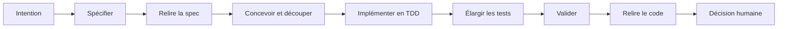

# Comprendre le framework Spec-Driven Development

## En bref

Ce projet n'est ni une bibliothèque Java, ni un paquet npm, ni un générateur
d'application. C'est un ensemble de fichiers à intégrer dans un dépôt :

- des skills Codex qui guident chaque étape du développement ;
- des rôles d'agents spécialisés ;
- des modèles pour produire des documents au format stable ;
- des règles qui empêchent de sauter les étapes importantes ;
- un harness qui exécute les contrôles de qualité localement et en CI ;
- des exemples complets pour un projet neuf et un projet existant.

L'idée centrale est simple : l'agent ne doit pas seulement écrire du code. Il
doit aussi rendre explicites ses hypothèses, prouver que les critères
d'acceptation sont couverts et fournir les éléments permettant à un humain de
prendre la décision finale.

Ce guide adapte à Spring Boot, React et Next.js les fichiers du dépôt et le
parcours end-to-end initialement présenté par Loiane Groner avec Angular dans
l'article
[Specs-Driven Development in Practice](https://loiane.com/2026/05/specs-driven-development-end-to-end-with-spring-boot-angular/).


## Pourquoi encadrer le « vibe coding » ?


Le framework réduit les risques de dérive avec quatre principes :

1. **Aucune invention silencieuse.** Une information manquante devient une
   question ouverte `Q-NNN` qui doit être résolue ou explicitement reportée.
2. **Un résultat observable par phase.** Chaque étape écrit un artefact versionné
   sous `.specs/<feature-id>/`.
3. **Le TDD comme contrainte de travail.** Une modification du code de production
   doit être précédée d'un test qui échoue pour la raison attendue.
4. **Des preuves avant la conclusion.** Le build, les tests, la couverture, les
   contrats et les contrôles de sécurité sont exécutés par un même harness.

## Le cycle de développement via ce framework



Le cycle normal d'une fonctionnalité est le suivant :

| Étape                    | Commande       | Résultat principal                               | Condition de sortie                                     |
|--------------------------|----------------|--------------------------------------------------|---------------------------------------------------------|
| 1. Spécifier             | `$spec`        | `01-spec.md`                                     | Critères identifiés, aucune question ouverte            |
| 2. Relire la spec        | `$spec-review` | `02-spec-review.md`                              | Checklist validée et accord enregistré                  |
| 3. Planifier             | `$plan`        | `03-design.md`, `04-tasks.md`                    | Chaque critère est relié à une tâche et à des tests     |
| 4. Implémenter           | `$build T-NNN` | `05-implementation-log.md`                       | Cycle rouge, vert, refactorisation consigné             |
| 5. Tester                | `$test`        | `06-test-plan.md`                                | Tests transverses et cas manquants couverts             |
| 6. Valider               | `$validate`    | `07-validation-report.md`, `07a-traceability.md` | Harness vert et traçabilité complète                    |
| 7. Relire le code        | `$review`      | `08-code-review.md`                              | Aucun problème bloquant ou majeur                       |
| 8. Préparer la livraison | `$ship`        | `09-ship-plan.md`                                | Plan de livraison complet, sans déploiement automatique |

Pour une initiative composée de plusieurs tranches verticales, `$epic-plan`
précède `$plan`. Il produit une conception globale et une roadmap avant le
découpage détaillé de chaque tranche.

Le skill `$onboard` joue un rôle différent : il prépare un dépôt existant,
enregistre sa dette actuelle comme baseline et propose une adoption progressive
des contrôles manquants.

## Préparer le dépôt : la phase 0

Avant la première spec, le dépôt doit contenir les fichiers du workflow et être
capable d'exécuter ses contrôles. Cette phase évite que chaque nouvelle demande
reparte d'une conversation vide, sans conventions partagées.

Pour un projet neuf, créez d'abord la structure applicative avec les outils
officiels — Spring Initializr pour Spring Boot et `create-next-app` pour Next.js
— puis ajoutez le framework. Les agents travaillent ainsi sur une base
compatible avec les versions réellement choisies par l'équipe au lieu
d'inventer un scaffold.

Après avoir copié les dossiers adaptés à votre outil, exécutez :

```text
$onboard
$wire-harness
```

`$onboard` détecte le module Maven, la stack et les éventuelles applications
front voisines. Il classe le projet en greenfield ou brownfield et produit les
artefacts de départ sous `.specs/`, notamment `_stack.json`, `_onboarding.md` et,
si des tests existent, `_baseline.json`.

`$wire-harness` raccorde ensuite les plugins Maven, les conventions de tests,
la couverture, le mutation testing et les contrôles de dépendances. Il refuse
de choisir silencieusement un outil de migration ou une version incompatible :
la décision doit être fournie ou documentée dans un ADR.

Dans un monorepo, passez le chemin du module Spring aux deux commandes. Le
frontend voisin est détecté comme contexte, mais conserve son propre pipeline.

## Du besoin aux preuves

Chaque fonctionnalité possède un répertoire dédié. Les noms et l'ordre des
fichiers constituent un contrat entre les rôles :

```text
.specs/<feature-id>/
├── 01-spec.md
├── 02-spec-review.md
├── 03-design.md
├── 04-tasks.md
├── 05-implementation-log.md
├── 06-test-plan.md
├── 07-validation-report.md
├── 07a-traceability.md
├── 08-code-review.md
├── 09-ship-plan.md          # optionnel
├── .tdd-state.json
└── adr/
    └── NNN-<decision>.md
```

Une Epic ajoute `03-epic-design.md` et `03a-epic-roadmap.md` avant la
conception détaillée.

Les identifiants stables assurent la traçabilité :

```text
ticket → AC-001 → T-003 → test AC-001 → code → validation → revue
```

- `AC-NNN` désigne un critère d'acceptation testable ;
- `Q-NNN` désigne une question qui ne doit pas être résolue par supposition ;
- `T-NNN` désigne une tâche d'implémentation ;
- les tests reprennent l'identifiant du critère qu'ils vérifient.

Le rapport `07a-traceability.md` permet ainsi de repérer un critère sans test,
une tâche sans justification ou du code qui ne correspond à aucun besoin
explicite.

## Les rôles spécialisés

Le framework sépare les responsabilités pour éviter qu'un même contexte pousse
l'agent à justifier ses propres choix :

| Rôle                                             | Responsabilité                                                 |
|--------------------------------------------------|----------------------------------------------------------------|
| `spec-author`                                    | Transformer la demande en critères d'acceptation sans inventer |
| `spring-architect` / `react-nextjs-architect`         | Concevoir la solution et découper le travail                   |
| `spring-test-engineer` / `react-nextjs-test-engineer` | Écrire les tests et élargir la couverture                      |
| `spring-implementer` / `react-nextjs-implementer`     | Produire le minimum de code nécessaire pour passer les tests   |
| `spring-validator` / `react-nextjs-validator`         | Lire les rapports du harness et contrôler la traçabilité       |
| `spring-code-reviewer` / `react-nextjs-code-reviewer` | Examiner le diff avant le commit                               |

Le routage dépend du périmètre détecté : backend, frontend ou full-stack. Une
fonctionnalité full-stack fait intervenir les deux familles de rôles, avec des
tâches et des preuves propres à chaque partie.

Pour un flux full-stack, le contrat de l'API est défini dans la conception avant
l'interface. Une séquence courante consiste à stabiliser les réponses, erreurs
et validations Spring Boot, puis à développer le formulaire React/Next.js
contre ce contrat. Des tâches backend et frontend réellement indépendantes
peuvent aussi avancer en parallèle dès que le contrat partagé est approuvé.

## Le TDD contrôlé par état

Pour chaque tâche, `$build T-NNN` orchestre la boucle suivante :

1. le test engineer écrit un test minimal ;
2. le test est exécuté et doit échouer pour la raison prévue ;
3. cet échec est enregistré dans `.tdd-state.json` ;
4. l'implementer peut alors modifier le code de production ;
5. les tests sont rejoués jusqu'au vert ;
6. le code est refactoré et simplifié avec la suite toujours verte.

Codex charge les instructions de `AGENTS.md`, les skills séparés sous
`.agents/skills/`, les agents sous `.codex/agents/` et les hooks projet sous
`.codex/hooks.json`. Les hooks doivent être examinés et approuvés avec `/hooks`
avant de servir de protection mécanique.

Comme la spec, la conception, la liste des tâches, l'état TDD et le journal
d'implémentation sont enregistrés dans Git, une session d'agent n'a pas besoin
de porter tout l'historique de la fonctionnalité. Il est possible de fermer la
session après une phase ou une tâche, puis de reprendre depuis les artefacts.
Cette propriété limite la perte de contexte et garde chaque échange plus ciblé.

## Hooks et harness : deux niveaux de protection

Les **hooks** sont déclenchés automatiquement avant ou après une action Codex
précise. Ils effectuent un contrôle court et ciblé : vérifier qu’un fichier est
dans le périmètre, qu’un test rouge autorise une édition de production ou qu’une
commande ne contourne pas les tests. Un hook peut refuser l’action immédiatement.

Le **harness** est lancé explicitement par `$validate`, depuis un terminal ou en
CI. Il examine l’état global du projet au moyen de dix couches : compilation,
tests, analyses, architecture, couverture, mutations, contrat et sécurité.

Ainsi, **le hook protège le geste en cours, tandis que le harness apporte les
preuves globales avant la validation**.

## Le harness de qualité

Le script `.github/scripts/harness.sh` sert de point d'entrée commun à l'agent,
au développeur et à la CI. Il exécute les contrôles du moins coûteux au plus
coûteux :

| Couche                   | Ce qu'elle cherche à prouver                              |
|--------------------------|-----------------------------------------------------------|
| Format et lint           | Le code respecte les conventions automatiques             |
| Compilation              | Le projet peut être construit                             |
| Analyse statique         | Les motifs connus comme dangereux sont détectés           |
| Architecture             | Les frontières de modules restent respectées              |
| Tests unitaires et slice | La logique locale reste correcte                          |
| Tests d'intégration      | Les interactions réelles fonctionnent                     |
| Couverture               | Les chemins importants sont exercés                       |
| Mutation testing         | Les tests détectent de vraies altérations du comportement |
| Contrat OpenAPI          | Une API n'est pas cassée involontairement                 |
| Sécurité                 | Les dépendances vulnérables sont signalées                |

Dans un projet existant, les échecs antérieurs peuvent être enregistrés dans
`.specs/_baseline.json`. Ils restent visibles, mais seule une régression introduite
par la nouvelle fonctionnalité bloque le cycle. Cette logique permet d'adopter
le framework sans devoir résorber toute la dette technique dès le premier jour.

## Connecter les sources de contexte

`$spec` peut partir d'une description saisie dans le chat ou d'un ticket. Avec
un connecteur adapté, l'agent peut lire directement une GitHub Issue, un ticket
Jira ou une autre source et enregistrer son identifiant dans `01-spec.md`.

Le même principe s'applique aux maquettes : si une demande référence Figma,
l'agent doit avoir accès au fichier pour en extraire les intentions de mise en
page et d'interaction. Sans connecteur, fournissez le texte ou les captures
nécessaires explicitement. Le framework ne doit jamais combler un contexte
inaccessible par une supposition.

## Commencer sur une première fonctionnalité

Après avoir intégré les dossiers Codex et raccordé le
harness au projet, un premier parcours peut rester très simple :

```text
$spec "Permettre à un client d'appliquer une carte cadeau"
$spec-review
$plan
$build T-001
$test --gap
$validate
$review
```

Répétez `$build T-NNN` pour chaque tâche présente dans `04-tasks.md`. Une fois
la validation et la revue au vert, **le commit reste une action humaine**. La
commande `$ship`, si elle est utilisée, prépare le plan de livraison mais ne
déploie rien.

Pour découvrir le résultat attendu sans installer le framework, consultez
l'[exemple greenfield](../examples/greenfield/README.md). Pour un dépôt déjà en
production, partez plutôt de l'[exemple brownfield](../examples/brownfield/README.md).

Les prérequis et les deux modes d'installation sont détaillés dans le
[README principal](../README.md#installation).


## Organisation du dépôt

```text
docs/       documentation de la méthode et des contrats
AGENTS.md   instructions persistantes du projet
.agents/    un dossier distinct par skill Codex
.codex/     agents, hooks, modèles, checklists et fragment Maven
.github/    scripts du harness et configuration GitHub standard
examples/   exemples documentaires greenfield et brownfield
```

Chaque skill possède une seule source de vérité sous `.agents/skills/`. Les
workflows référencent les skills métier dont ils ont besoin sans les fusionner.

## Aller plus loin

- [Article end-to-end de Loiane Groner](https://loiane.com/2026/05/specs-driven-development-end-to-end-with-spring-boot-angular/) —
  source méthodologique d'origine avec Spring Boot et Angular
- [Méthodologie détaillée](methodology.md) — phases, contrats d'entrée et de sortie
- [Principes du harness](harness-principles.md) — contrôles, seuils et rapports
- [Format des spécifications](spec-format.md) — critères EARS-lite et conventions
- [Contrat des artefacts](artifact-contract.md) — fichiers et état TDD
- [Migration vers Codex](codex-migration.md) — correspondances et vérifications officielles
- [Exemples complets](../examples/README.md) — parcours greenfield et brownfield
